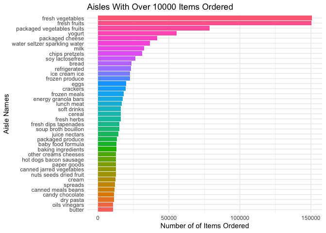
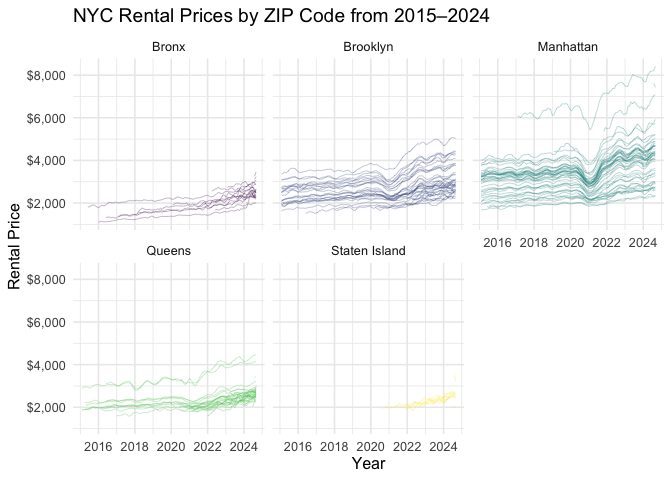

P8105 HW3
================
Veerapetch Petchger
2025-10-05

## Problem 1

The goal is to do some exploration of this dataset. To that end, write a
short description of the dataset, noting the size and structure of the
data, describing some key variables, and giving illustrative examples of
observations. Then, do or answer the following (commenting on the
results of each):

1.  How many aisles are there, and which aisles are the most items
    ordered from?

``` r
instacart %>% 
  count(aisle, name = "n_obs") %>%
  arrange(desc(n_obs)) %>% 
  head()
```

    ## # A tibble: 6 × 2
    ##   aisle                          n_obs
    ##   <chr>                          <int>
    ## 1 fresh vegetables              150609
    ## 2 fresh fruits                  150473
    ## 3 packaged vegetables fruits     78493
    ## 4 yogurt                         55240
    ## 5 packaged cheese                41699
    ## 6 water seltzer sparkling water  36617

There are 134 different aisles. The `fresh vegetables` and
`fresh fruits` are by far the most popular aisles, followed by
`packaged vegetables fruits`, `yogurt`, and `packaged cheese`.

2.  Make a plot that shows the number of items ordered in each aisle,
    limiting this to aisles with more than 10000 items ordered. Arrange
    aisles sensibly, and organize your plot so others can read it.

``` r
instacart %>%
  count(aisle, name = "n_obs") %>%
  filter(n_obs > 10000) %>%
  mutate(aisle = forcats::fct_reorder(aisle, n_obs)) %>%
  ggplot(aes(x = aisle, y = n_obs, fill = aisle)) +
  geom_col() +
  coord_flip() +
  labs(
    title = "Aisles With Over 10000 Items Ordered",
    x = "Aisle Names",
    y = "Number of of Items Ordered"
  ) +
  viridis::scale_color_viridis(discrete = TRUE) +
  theme_minimal() +
  theme(legend.position = "none")
```

<!-- -->

3.  Make a table showing the three most popular items in each of the
    aisles “baking ingredients”, “dog food care”, and “packaged
    vegetables fruits”. Include the number of times each item is ordered
    in your table.

``` r
instacart %>%
  filter(aisle %in% c("baking ingredients", "dog food care", "packaged vegetables fruits")) %>% 
  group_by(aisle, product_name) %>% 
  summarize(order_count = n()) %>%
  arrange(aisle, desc(order_count)) %>%
  slice_max(order_count, n = 3) %>% 
  knitr::kable(caption = "Top 3 Most Popular Items from the Baking Ingredients, Dog Food Care, and Packaged Vegetables/Fruits Aisles")
```

    ## `summarise()` has grouped output by 'aisle'. You can override using the
    ## `.groups` argument.

| aisle | product_name | order_count |
|:---|:---|---:|
| baking ingredients | Light Brown Sugar | 499 |
| baking ingredients | Pure Baking Soda | 387 |
| baking ingredients | Cane Sugar | 336 |
| dog food care | Snack Sticks Chicken & Rice Recipe Dog Treats | 30 |
| dog food care | Organix Chicken & Brown Rice Recipe | 28 |
| dog food care | Small Dog Biscuits | 26 |
| packaged vegetables fruits | Organic Baby Spinach | 9784 |
| packaged vegetables fruits | Organic Raspberries | 5546 |
| packaged vegetables fruits | Organic Blueberries | 4966 |

Top 3 Most Popular Items from the Baking Ingredients, Dog Food Care, and
Packaged Vegetables/Fruits Aisles

4.  Make a table showing the mean hour of the day at which Pink Lady
    Apples and Coffee Ice Cream are ordered on each day of the week;
    format this table for human readers (i.e. produce a 2 x 7 table).

``` r
instacart %>%
  filter(product_name %in% c("Pink Lady Apples", "Coffee Ice Cream")) %>%
  group_by(product_name, order_dow) %>% 
  summarize(mean_hour = mean(order_hour_of_day)) %>% 
  pivot_wider(
    names_from = order_dow,
    values_from = mean_hour,
    names_prefix = "Day_"
  ) %>% 
    knitr::kable(caption = "Average Hour of Ordering Pink Lady Apples and Coffe Ice Cream by Day of the Week")
```

    ## `summarise()` has grouped output by 'product_name'. You can override using the
    ## `.groups` argument.

| product_name     |    Day_0 |    Day_1 |    Day_2 |    Day_3 |    Day_4 |    Day_5 |    Day_6 |
|:-----------------|---------:|---------:|---------:|---------:|---------:|---------:|---------:|
| Coffee Ice Cream | 13.77419 | 14.31579 | 15.38095 | 15.31818 | 15.21739 | 12.26316 | 13.83333 |
| Pink Lady Apples | 13.44118 | 11.36000 | 11.70213 | 14.25000 | 11.55172 | 12.78431 | 11.93750 |

Average Hour of Ordering Pink Lady Apples and Coffe Ice Cream by Day of
the Week

## Problem 2

This Problem uses the Zillow datasets introduced in Homework 2. Both
datasets are available here. Import, clean, and otherwise tidy these
datasets.

``` r
zip_codes_df =
  read_csv("zillow_data/Zip Codes.csv", na = c("NA",".","")) %>% 
  janitor::clean_names() %>% 
  mutate(
    zip_code = as.character(zip_code),
    borough  = recode(
      county,
      "New York" = "Manhattan",
      "Kings"    = "Brooklyn",
      "Queens"   = "Queens",
      "Bronx"    = "Bronx",
      "Richmond" = "Staten Island",
    )
  ) %>%
  select(zip_code, borough)
```

    ## Rows: 322 Columns: 7
    ## ── Column specification ────────────────────────────────────────────────────────
    ## Delimiter: ","
    ## chr (4): County, County Code, File Date, Neighborhood
    ## dbl (3): State FIPS, County FIPS, ZipCode
    ## 
    ## ℹ Use `spec()` to retrieve the full column specification for this data.
    ## ℹ Specify the column types or set `show_col_types = FALSE` to quiet this message.

``` r
zora_df =
  read_csv("zillow_data/Zip_zori_uc_sfrcondomfr_sm_month_NYC.csv", na = c("NA",".","")) %>% 
  janitor::clean_names() %>%
  pivot_longer(
    cols = x2015_01_31:x2024_08_31,
    names_to = "ym_str",
    values_to = "rent"
  ) %>%
  rename(zip_code = region_name) %>% 
  mutate(
    ym_str = stringr::str_remove(ym_str, "^x"),
    ym_str = stringr::str_replace_all(ym_str, "_", "-"),
    date   = lubridate::ymd(ym_str),
    year   = lubridate::year(date),
    month  = lubridate::month(date),
    day    = lubridate::day(date),
    zip_code = as.character(zip_code)) %>%
  select(-ym_str)
```

    ## Rows: 149 Columns: 125
    ## ── Column specification ────────────────────────────────────────────────────────
    ## Delimiter: ","
    ## chr   (6): RegionType, StateName, State, City, Metro, CountyName
    ## dbl (119): RegionID, SizeRank, RegionName, 2015-01-31, 2015-02-28, 2015-03-3...
    ## 
    ## ℹ Use `spec()` to retrieve the full column specification for this data.
    ## ℹ Specify the column types or set `show_col_types = FALSE` to quiet this message.

``` r
zillow_df =
  zora_df %>% 
  left_join(zip_codes_df, by = "zip_code")
```

    ## Warning in left_join(., zip_codes_df, by = "zip_code"): Detected an unexpected many-to-many relationship between `x` and `y`.
    ## ℹ Row 4757 of `x` matches multiple rows in `y`.
    ## ℹ Row 256 of `y` matches multiple rows in `x`.
    ## ℹ If a many-to-many relationship is expected, set `relationship =
    ##   "many-to-many"` to silence this warning.

1.  There are 116 months between January 2015 and August 2024. How many
    ZIP codes are observed 116 times? How many are observed fewer than
    10 times? Why are some ZIP codes are observed rarely and others
    observed in each month?

``` r
zip_count_df =
  zillow_df %>% 
  filter(
    date >= "2015-01-01" & date <= "2025-08-01",
    !is.na(zip_code),
    !is.na(rent)
         ) %>% 
  group_by(zip_code) %>% 
  summarize(n_obs = n_distinct(date))
```

There are 48 ZIP codes observed for all the months, and 26 ZIP codes
observed fewer than 10 times. The reasons for the difference in coverage
across ZIP codes could be that 1) months with very few listings are not
published, 2) ZIP codes may have been introduced, discontinued, or
redefined during the time period, and 3) ZIP codes that are primarily
non-residential such as airports or campuses will have inconsistent
rental data.

2.  Create a reader-friendly table showing the average rental price in
    each borough and year (not month). Comment on trends in this table.

``` r
zillow_df %>%
  filter(
    !is.na(zip_code),
    !is.na(borough),
    !is.na(rent)) %>% 
  group_by(borough, year) %>% 
  summarize(avg_rent = mean(rent, na.rm = TRUE)) %>% 
  arrange(year) %>% 
  pivot_wider(
    names_from = "borough",
    values_from = "avg_rent"
  ) %>% 
  knitr::kable(caption = "Average ZORI by Borough and Year")
```

    ## `summarise()` has grouped output by 'borough'. You can override using the
    ## `.groups` argument.

| year |    Bronx | Brooklyn | Manhattan |   Queens | Staten Island |
|-----:|---------:|---------:|----------:|---------:|--------------:|
| 2015 | 1759.595 | 2492.928 |  3006.291 | 2214.707 |            NA |
| 2016 | 1520.194 | 2520.357 |  3014.570 | 2271.955 |            NA |
| 2017 | 1543.599 | 2545.828 |  3109.104 | 2263.303 |            NA |
| 2018 | 1639.430 | 2547.291 |  3159.668 | 2291.918 |            NA |
| 2019 | 1705.589 | 2630.504 |  3285.334 | 2387.816 |            NA |
| 2020 | 1811.443 | 2555.051 |  3091.327 | 2315.632 |      1977.608 |
| 2021 | 1857.777 | 2549.890 |  3124.336 | 2210.787 |      2045.430 |
| 2022 | 2054.267 | 2868.199 |  3753.080 | 2406.038 |      2147.436 |
| 2023 | 2285.459 | 3015.184 |  3908.215 | 2561.615 |      2332.934 |
| 2024 | 2496.896 | 3125.657 |  4052.805 | 2693.584 |      2536.442 |

Average ZORI by Borough and Year

Apart from Staten Island, there is a general increase in rent from
2015-2019. The pandemic caused different reactions across the boroughs
in 2020-2021, after which average rent prices continued to steadily
increase. Manhattan is visibly the most expensive borough, followed by
Brooklyn, Queens, Staten Island, and the Bronx.

3.  Make a plot showing NYC Rental Prices within ZIP codes for all
    available years. Your plot should facilitate comparisons across
    boroughs. Comment on any significant elements of this plot.

``` r
rent_p =  
  zillow_df %>% 
  filter(
    !is.na(zip_code),
    !is.na(borough),
    !is.na(rent)) %>% 
  ggplot(aes(x = date, y = rent, group = zip_code, color = borough)) +
  geom_line(linewidth = 0.1) +
  labs(
    title = "NYC Rental Prices by ZIP Code from 2015–2024",
    x = "Year",
    y = "Rental Price",
    color = "Borough"
  ) +
  scale_y_continuous(labels = scales::dollar) +
  viridis::scale_color_viridis(discrete = TRUE) +
  theme_minimal(base_size = 12) +
  theme(legend.position = "none") +
  facet_wrap(. ~ borough, ncol = 3)
rent_p
```

<!-- -->

This figure depicts rental price trends of every NYC ZIP code from
2015-2024, sorted by borough. Each line represents one ZIP code,
allowing for comparisons within boroughs. These findings reinforce the
previous statements regarding the pandemic’s disruptions and subsequent
rebounding of the city’s rental market. Manhattan and Brooklyn, the most
expensive boroughs, demonstrated higher volatility compared to the other
boroughs.

4.  Compute the average rental price within each ZIP code over each
    month in 2023. Make a reader-friendly plot showing the distribution
    of ZIP-code-level rental prices across boroughs; put differently,
    your plot should facilitate the comparison of the distribution of
    average rental prices across boroughs. Comment on this plot.

``` r
monthly_avg_2023_p =
  zillow_df %>% 
  filter(
    year == 2023,
    !is.na(zip_code),
    !is.na(borough),
    !is.na(rent)
  ) %>%
  group_by(borough, zip_code) %>% 
  summarize(monthly_avg_2023 = mean(rent, na.rm = TRUE), .groups = "drop") %>%
  ggplot(aes(x = borough, y = monthly_avg_2023, fill = borough)) +
  geom_boxplot(width = 0.5) +
  scale_y_continuous(labels = scales::dollar) +
  labs(
    title = "Average Monthly NYC Rental Prices by ZIP Code in 2023",
    x = "Borough",
    y = "Rental Price",
    color = "Borough"
  ) +
  viridis::scale_fill_viridis(discrete = TRUE) +
  theme_minimal(base_size = 12) +
  theme(legend.position = "none")
monthly_avg_2023_p
```

<!-- -->
This plot depicts the distribution of the average ZIP-code-level monthly
rent across boroughs in 2023. Manhattan has the highest median, but also
the widest spread of data. Brooklyn’s median is the second largest and
exhibits a similar spread of data to that of Manhattan. The remaining
boroughs have lower and similar medians and spread of data. Manhattan
and Queens have outlying data points, corresponding to their luxury
submarkets.

5.  Combine the two previous plots into a single graphic, and export
    this to a results folder in your repository.

``` r
monthly_avg_2023_p / rent_p
```

<!-- -->

``` r
ggsave("combined.pdf")           
```

    ## Saving 7 x 5 in image
